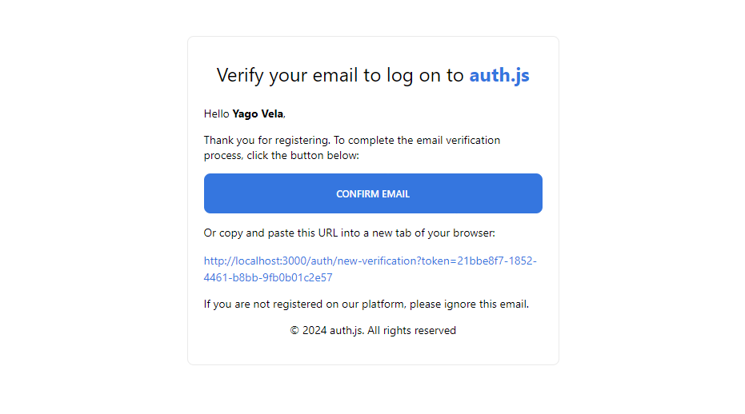
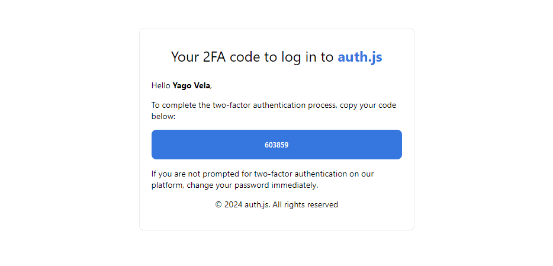
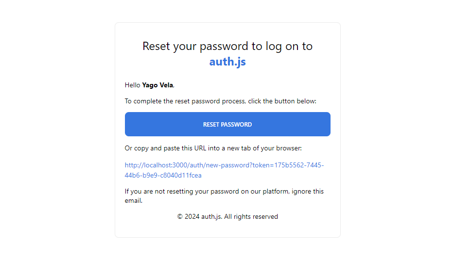

<h1 align="center">
  Auth.js
</h1>

<p align="center">
  <a href="https://www.linkedin.com/in/yagovela/" target="_blank" rel="noopener noreferrer">
    
  </a>
  <a href="https://github.com/yagovelaa" target="_blank" rel="noopener noreferrer">
    
  </a>
</p>

## 💻 About the project

This project was made to study auth.js, we have features like Two-Factor Authentication (2FA), Forgot Password functionality, Email Verification functionality, Credential login, OAuth login (Google and Github) and much more.

**Project**

https://github.com/yagovelaa/auth.js/assets/133478879/5568eb60-8b4b-4e8f-bc1c-43dd2a68d92f

**Email template screenshots**

<div align="center">
  
  
  
</div>

## 🛠️ Technologies

- [Next.js](https://nextjs.org/)
- [Node.js](https://nodejs.org/en)
- [Auth.js](https://authjs.dev/)
- [Prisma](https://www.prisma.io/)
- [Postgresql](https://www.postgresql.org/)
- [Neon](https://neon.tech/)
- [Resend](https://resend.com)
- [ShadcnUI](https://ui.shadcn.com/)

## 🛠️ Features

- 🔐 Next-auth v5 (Auth.js)
- 🚀 Next.js 14 with server actions
- 🔑 Credentials Provider
- 🌐 OAuth Provider (Social login with Google & GitHub)
- 🔒 Forgot password functionality
- ✉️ Email verification
- 📱 Two factor verification (2FA)
- 👥 User roles (Admin & User)
- 🖥️ Example with server component
- 🛡️ Protect API Routes for admins only
- 🔐 Protect Server Actions for admins only
- 💻 Example with client component
      
## 💻 Getting started

**Clone the project and access the folder**

```bash
$ git clone https://github.com/yagovelaa/auth.js.git
```
**Dependencies**

```bash
# Install the dependencies
$ npm i

# To start the project in dev mode, run this command
$ npm dev
```

**.env example**

```bash
DATABASE_URL=
AUTH_SECRET=

GITHUB_CLIENT_ID=
GITHUB_CLIENT_SECRET=

GOOGLE_CLIENT_ID=
GOOGLE_CLIENT_SECRET=

RESEND_API_KEY=
```

**Hash**

```bash
# Create your secret hash and insert it into the environment variable
# More information https://bcrypt.online/

$ AUTH_SECRET
```

**Prisma**

```bash
# Generate Prisma Client with the following command:
$ npx prisma generate

# Use db push to push the initial schema to the database:
$ npx prisma db push
```

**Neon**

```bash
# It is necessary to create an account and project, with the created project copy the DATABASE_URL and paste it into the .env
$ DATABASE_URL

# More information https://neon.tech/docs/introduction
```

**Resend**

```bash
# You need to create an account and copy the api key and paste it into the .env
$ RESEND_API_KEY

# More information https://resend.com
```

**Google**

```bash
# Configure GoogleAuth, you need to create a Google account and follow the documentation below:
# More information https://support.google.com/cloud/answer/6158849?hl=en

# Insert environment variables in .env
$ GOOGLE_CLIENT_ID=
$ GOOGLE_CLIENT_SECRET=
```

**Github**

```bash
# Configure GithubAuth, you need to create a Github account and follow the documentation below:
# More information https://docs.github.com/en/apps/oauth-apps/building-oauth-apps/creating-an-oauth-app

# Insert environment variables in .env
$ GITHUB_CLIENT_ID=
$ GITHUB_CLIENT_SECRET=
```


